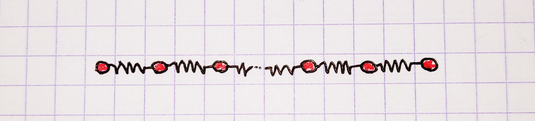
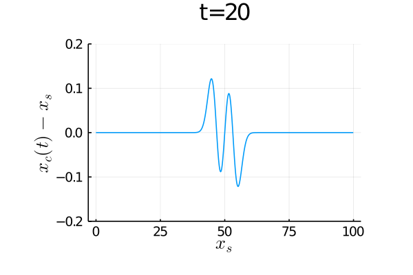
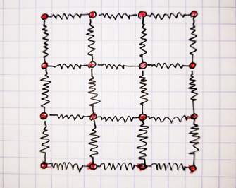

# Spring.jl
## A simple Julia Tutorial dedicated to the dynamic of 1D and 2D sets of masses connected with springs.

### 1D System :




```julia
] activate .
] instantiate
include("main1D.jl")
```



### 2D System :





```julia
] activate .
] instantiate
include("main1D.jl")
include("main1D.jl") #run twice to get proper timings
```


### 2D System with Makie display (requires OpenGL capable machine)

```julia
cd("MakiePlots")
] activate .
] instantiate
include("main_makie.jl")
```


